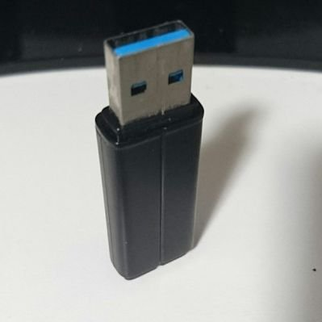
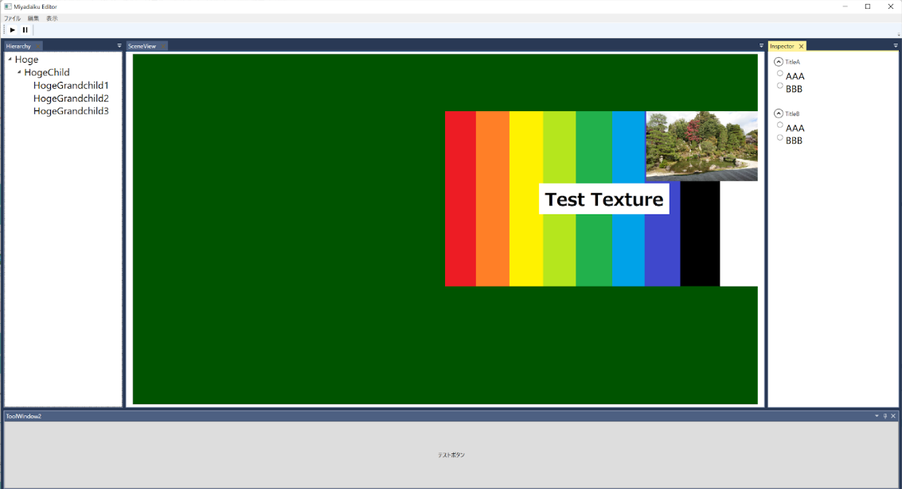

# Miyazaki Taisuke's portfolio

!!! note
    就活完了しました。  
    このページは記録用＆今後何かで使うかもしれないので、残しています。  

!!! note
    本ポートフォリオは、継続的にデプロイされています。  
    最新のデプロイ： [https://mewmew-tea.github.io/Portfolio/](https://mewmew-tea.github.io/Portfolio/)   
    GitHubリポジトリ：[https://github.com/mewmew-tea/Portfolio](https://github.com/mewmew-tea/Portfolio)

## **自己紹介**

{ align=left width=25% }
   
**名前：**宮﨑 泰輔    
**特技/趣味：**剣道初段、油彩画鑑賞、ルービックキューブ など  

:fontawesome-brands-twitter: **Twitter：**[@mewmew_tea](https://twitter.com/mewmew_tea)   
:fontawesome-brands-github: **GitHub：**[https://github.com/mewmew-tea](https://github.com/mewmew-tea)  
:simple-qiita: **Qiita：**[https://qiita.com/mewmew_tea](https://qiita.com/mewmew_tea)  
:simple-blogger: **個人ブログ：**[https://nekocha.hatenablog.com/](https://nekocha.hatenablog.com/)  
 
私は技術を知ったり触れることが好きです。  
とくに、幅広い分野に触れることが出来るゲームエンジン開発はとても楽しく感じていて、日々ゲームエンジンの自作に勤しんでいます。  

## **[このポートフォリオの工夫（クリックで詳細へ）](./works/thisPortfolio.md)**

このポートフォリオは、Markdownで記述され、継続的にデプロイ（CD）されているなど、様々な工夫をしています。  

---

## **[Works（クリックですべての作品一覧へ）](./works/overview.md)**

### [MiyadaikuEngine 1.0](./works/MiyadaikuEngine1.0/overview.md)

{ align=right width=50% }

開発中の自作のゲームエンジン。  
C#スクリプティングや、EditorとRuntimeのプロセスを分離、TCP/IPによるプロセス間通信などが特徴。  
ゲーム開発のイテレーションを向上させるため、コア部分から丁寧に設計し機能を充実させている。

### [がっぽり！爆走人力車](./works/jinrikisha.md)

人力車の車夫として、爆走しながら次々と客をお届けするゲーム。 
チーム（５人のプログラマ）で２か月間で開発。企画とリードプログラマを担当。 
Unityで開発し、Xbox Series X|SとPCでリリース。 

<iframe width="560" height="315" src="https://www.youtube.com/embed/9TtBH1gOD1E" title="YouTube video player" frameborder="0" allow="accelerometer; autoplay; clipboard-write; encrypted-media; gyroscope; picture-in-picture" allowfullscreen></iframe>

**他多数。
そのほか作品リストは[こちら](./works/overview.md)から**

--- 

## **[Skills（クリックで詳細へ）](./skills.md)**

様々な技術について、幅広く深く勉強をしています。

---

