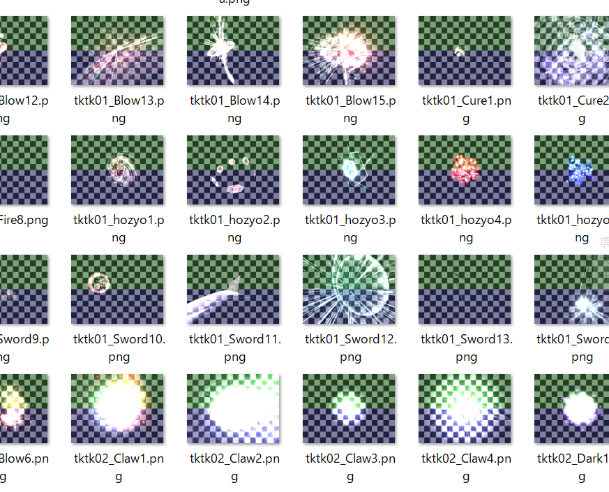

# Effekseer

[Miyadaiku Engine 1.0](../MiyadaikuEngine1.0/overview.md)の開発と並行して、
２０２２年１２月現在、私はEffekseerの次期バージョンに向けての新機能開発に参加しています。  

Effekseerは、ゲームエフェクトを作成するためのツールおよび、様々な環境で再生するためのミドルウェアです。  
オープンソースで開発されていて、世界中に多くのユーザーが居ます。  

[https://effekseer.github.io/jp/](https://effekseer.github.io/jp/)

アセットの再利用性を高めるための「SubEffect（仮称）」機能の開発のコアメンバーの一人として、開発に取り組んでいます。  

<!-- （イメージ図）  
 -->

!!! info
    「SubEffect（仮称）」機能は、複数のエフェクトを組み合わせて、１つのエフェクトにすることができるようになる機能です。  
    任意のNodeに別のエフェクトを割り当てることができます。  
    これは、UnityのNested Prefab（プレハブの中にプレハブを入れることが出来る機能）に似た機能です。  

また、海外のユーザーも多いので、英語でコミットメッセージやコメント等を書いています。  

## 開発内容

今回の機能実装に伴い、  
シリアライズ方式、オブジェクトシステム、エディタ設計など、  
大規模な再構築をしています。  

中でも、私は、エディタ、シリアライズ、テストなどを中心に携わっています。  

作業についてのログは、こちらのIssueにて随時更新しています。
ぜひご一読ください。  
※備考：私のGitHubユーザー名は「mewmew-tea」です。  
**[https://github.com/effekseer/Effekseer/issues/894](https://github.com/effekseer/Effekseer/issues/894)**

---
### エディタ：Inspectorの作り替え

シリアライズ方式の変更に合わせて、エディタのパラメータ調整のためのInspector（旧名称：ParameterList）をすべて作り替えています。   

機能や見た目はそのまま維持しつつ、今後の機能拡張を行いやすくしています。  

UnityのInspectorやGodot Engineの実装を参考にしながら開発中です。   

- パラメータをC#リフレクションで解析してGUIを自動で構築する仕組み
- ノードオブジェクトの管理方式の変更対応
- Undo/Redo
- 海外のユーザーに向けて、多言語へのローカライズにも対応  

---

### ランタイム＆エディタ：シリアライズ形式の大幅変更

シリアライズ方式の大幅変更にも携わっています。  
具体的には、[FlatBuffers](https://google.github.io/flatbuffers/)を採用します。  

以前のバージョンとの後方互換性を維持するための実装も行います。  

---

### テストの計画、開発

大幅な変更に伴い、テストを計画・実装しています。  
新旧バージョンそれぞれで、エフェクトを再生・スクリーンショットを撮影して、  
すべて差異が無いかをチェックするテストです。  

1. 300を超えるエフェクト素材を自動でDL、テストしやすい形式に整える（Python）
1. 上記のエフェクト素材をすべて再生、スクリーンショットを撮影（C++）
1. Pythonスクリプトで新旧バージョンのスクリーンショットを比較（開発中）

<figure markdown>
  { width="600" }
  <figcaption>大量のエフェクトを次々に再生し、 スクリーンショットを撮影している様子</figcaption>
</figure>

<figure markdown>
  { width="600" }
  <figcaption>撮影されたスクリーンショット</figcaption>
</figure>

このテストの目的は、「後方互換性が正しく保たれているか？」も確認します。  
よって、例えば以下のようなパターンで撮影、比較を計画しています。  

- 旧形式のファイルを、旧バージョンで再生
- **^^旧型式のファイルを新形式へ変換^^**、**^^新バージョン^^**で再生

