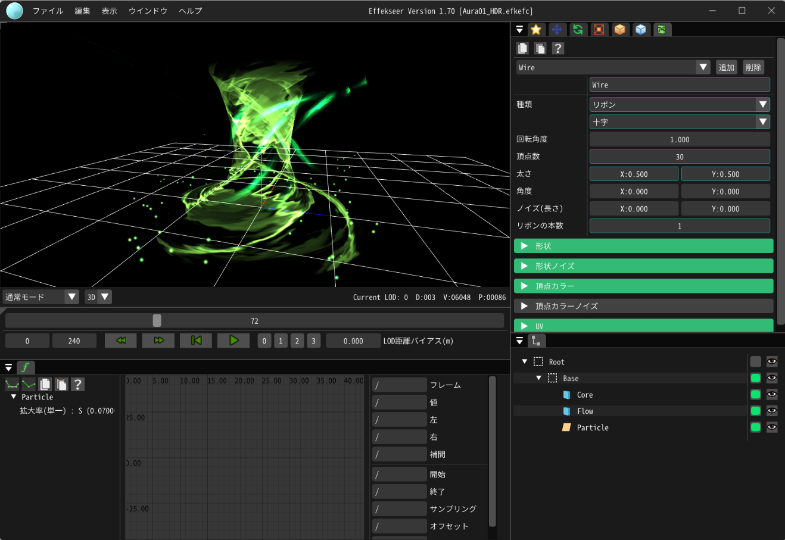
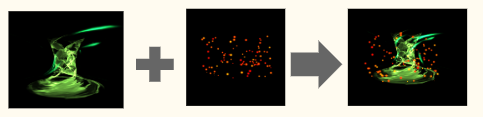
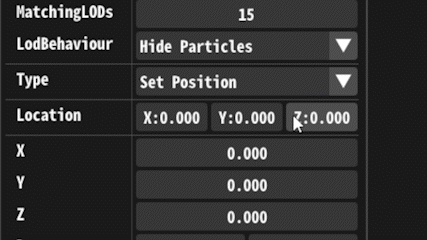

# Effekseer

Effekseerは、ゲームエフェクトを作成するためのツールおよび、様々な環境で再生するためのミドルウェアです。  
オープンソースで開発されていて、世界中に多くのユーザーが居ます。

[https://effekseer.github.io/jp/](https://effekseer.github.io/jp/)

２０２２年１１月現在、私は次期バージョン「１．８」に向けての開発に参加しています。  

アセットの再利用性を高めるための「SubEffect（仮称）」機能の開発のコアメンバーとして設計や実装をしています。  

<!-- （イメージ図）  
 -->

!!! info
    「SubEffect（仮称）」機能は、複数のエフェクトを組み合わせて、１つのエフェクトにすることができるようになる機能です。  
    UnityのNested Prefab（プレハブの中にプレハブを入れることが出来る機能）に似た機能になる予定です。

## 開発内容

今回の機能実装に伴い、  
シリアライズ方法、オブジェクトシステム、エディタ設計など、  
大規模な再構築をしています。  

エディタや、シリアライズ、テストを書くなどをしています。  

作業についてのログは、こちらのIssueにて随時更新しています。
ぜひご一読ください。  
（備考：私のGitHubユーザー名は「mewmew-tea」です。）
**[https://github.com/effekseer/Effekseer/issues/894](https://github.com/effekseer/Effekseer/issues/894)**

---
### エディタ：Inspectorの作り替え

シリアライズ方式の変更に合わせて、エディタのパラメータ調整のためのInspector（旧名称：ParameterList）をすべて作り替えています。   

機能や見た目はそのまま維持しつつ、今後の機能拡張を行いやすくしています。  

UnityのInspectorやGodot Engineの実装を参考にしながら開発中です。   

- パラメータをC#リフレクションで解析してGUIを自動で構築する仕組み
- ノードオブジェクトの管理方式の変更
- Undo/Redo
- 海外のユーザーに向けて、多言語へのローカライズにも対応  

---

### ランタイム＆エディタ：シリアライズ形式の大幅変更

シリアライズ方式の大幅変更をします。  
具体的には、FlatBuffersの採用を予定しています。  
より高速な読み書きを実現する予定です。  

また、後方互換性を維持するための実装も行います。

---

### テストの計画、開発

大幅な変更に伴い、テストを計画・実装しています。  
新旧バージョンそれぞれでスクリーンショットを撮影し、差異が無いかをチェックするテストです。  

- 300を超えるエフェクト素材を自動でDL、テストしやすい形式に整える（Python）
- 上記のエフェクト素材をすべて再生、スクリーンショットを撮影（C++）
- Pythonスクリプトで新旧バージョンのスクリーンショットを比較（開発中）

このテストの目的は、「後方互換性が正しく保たれているか？」も確認します。  
よって、３つの状態でスクリーンショットの撮影と比較をします。

- 旧形式のファイルを、旧バージョンで再生
- **^^新形式^^**のファイルを、 **^^新バージョン^^**で再生
- **^^旧型式のファイルを新形式へ変換^^**、**^^新バージョン^^**で再生

