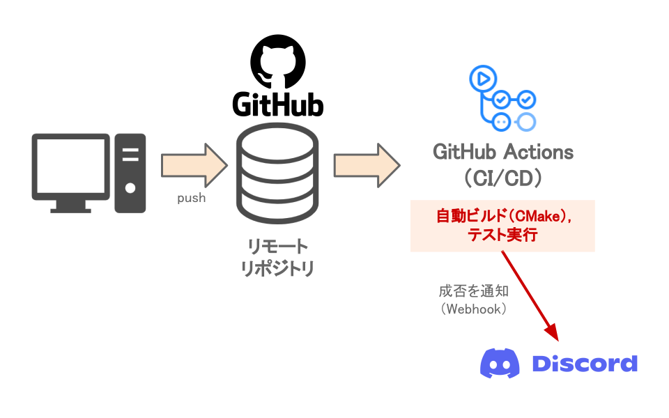

# ソースコードの品質管理（CI/CD）

ゲームエンジンは、再利用性の高さが特に求められます。  
そこで、エンジンソースの品質の維持・向上する取り組みが必要だと考え、力を入れています。  
  
また、人間にできることは限られているので、その多くは自動で実行しています。  
これは、いわゆる「CI」と呼ばれる分野になります。  
!!! note
    CIとは、自動でソフトウェアのビルドやテストを行い、品質管理を継続的に行う仕組みのことです。  

!!! note
    CI/CDの技術は、**このポートフォリオそのもの**にも活用しています。(詳細は[こちら](../thisPortfolio.md))

## CMake

## 単体テスト

## 自動コード整形

## GitHub Actions：CI/CDワークフローの自動実行

