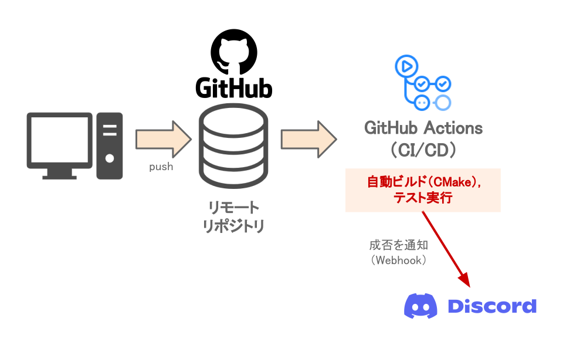

# ソースコードの品質管理（CI/CD）

ゲームエンジンは、再利用性の高さが特に求められます。  
そこで、エンジンソースの品質の維持・向上する取り組みが必要だと考え、力を入れています。  
  
また、人間にできることは限られているので、その多くは自動で実行しています。  
これは、いわゆる「CI」と呼ばれる分野になります。  
!!! note
    CIとは、自動でソフトウェアのビルドやテストを行い、品質管理を継続的に行う仕組みのことです。  

!!! note
    CI/CDの技術は、**このポートフォリオそのもの**にも活用しています。(詳細は[こちら](../thisPortfolio.md))

## CMake

CMakeを用いて自動ビルドをしています。  
また、一度CMake用のビルドスクリプトを定義すれば、そこから複数のプラットフォームに向けてビルドできるようになるので、今後のマルチプラットフォーム対応も容易になります。  

ちなみに、ここでVisualStudioの警告レベルを最大に設定して、安全なソースを書けるようにもしています。  

## 単体テスト
実装したものが正しく動くことは、確認しておくべきです。  
そこで、単体テストも書いています。  

想定通りの挙動をしているかを確認することで、品質を維持しています。  

<figure markdown>
  
  <figcaption>失敗するテストケース</figcaption>
</figure>
<figure markdown>
  
  <figcaption>失敗を示す表示</figcaption>
</figure>

## 自動コード整形

コードは、「Clang-format」を用いて自動整形されます。

## GitHub Actions：CI/CDワークフローの自動実行

テストやビルドなど、CI/CDのワークフローはGitHub Actionsを用いて構築しました。  
GitHub上のリモートリポジトリにpushしたタイミングで、自動でテストやビルドなどを実行します。  

また、ワークフローの成否は、WebhookでDiscord Botにより自動通知するようにしました。  
メールならGitHubの機能だけでも通知できますが、失敗した際に即時に対応できるようにしたかったので、Discordへ通知を送信しています。  

