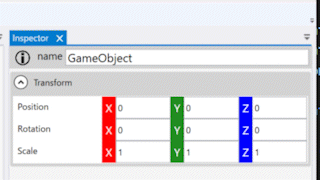

# エディタについて

エディタには「C#」「WPF（GUIフレームワーク）」を使って開発しています。    
WPFを使ったGUIの開発は初めてなので、独学で勉強をしつつ実装を進めています。  

## 「C#」「WPF」の採用理由

エディタの開発目標は２つあります。

- エディタの開発イテレーションを上げる
- 扱いやすいGUIを構築する

これを満たすために、使用する言語やGUIフレームワークについて、調査や比較をしました。  
   
まず、開発言語は、カスタム属性や拡張メソッドなどの機能があるC#に決定しました。（RuntimeのスクリプトもC#であるため、統一したいという考えでもあります）  
  
つづいて、C#で使えるGUIフレームワークを調査しました。  
「QtSharp」と「WPF」のどちらを採用するか悩みましたが、   
現在も継続的にアップデートが続いていて、新しい情報も多いWPFを採用しています。  
（QtSharpはマルチプラットフォームであるため魅力的でしたが、エディタはWindowsに限定しても問題ないと判断しました）

## MVVMパターン

GUIには「MVVM」というデザインパターンを用いて開発をしています。  
「Model」「View」「ViewModel」の三層構造で分けて開発することで、結合度が無駄に高くなることを防いでいます。  

## PrismとReactiveProperty

当初は、生のWPFそのままで開発を進めていましたが、作業量が莫大であることに気が付きました。  
そこで、MVVMのためのフレームワーク２つを使うことにしました。  

- View<->ViewModel間の連携：**「[Prism](https://prismlibrary.com/index.html)」**
- ViewModel<->Model間の連携：**「[ReactiveProperty](https://github.com/runceel/ReactiveProperty)」**

## Inspector

ゲームオブジェクトの情報や、付与されているコンポーネントを編集できます。  
C#スクリプト側で`[SerializeFid]`属性が付与されたフィールドとプロパティが表示されます。  

### フィールド編集用コントロール

値を表示・編集するためのコントロールは、すべて自作しています。  

これは、最適なGUIをエンジンユーザーに提供するためです。  

特に、`Vector3`などの数値のコントロールは、扱いやすくするため、ドラッグするだけでも値を増減できるようにしました。  
ちなみに、これはMVVMパターンにおける「View」側の実装にあたります。  

