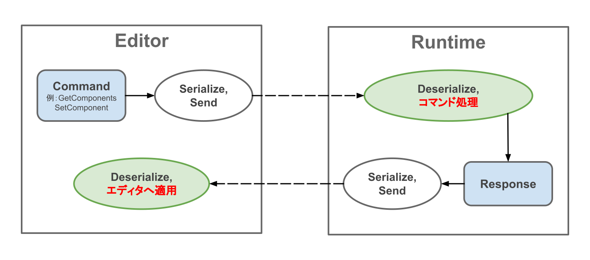
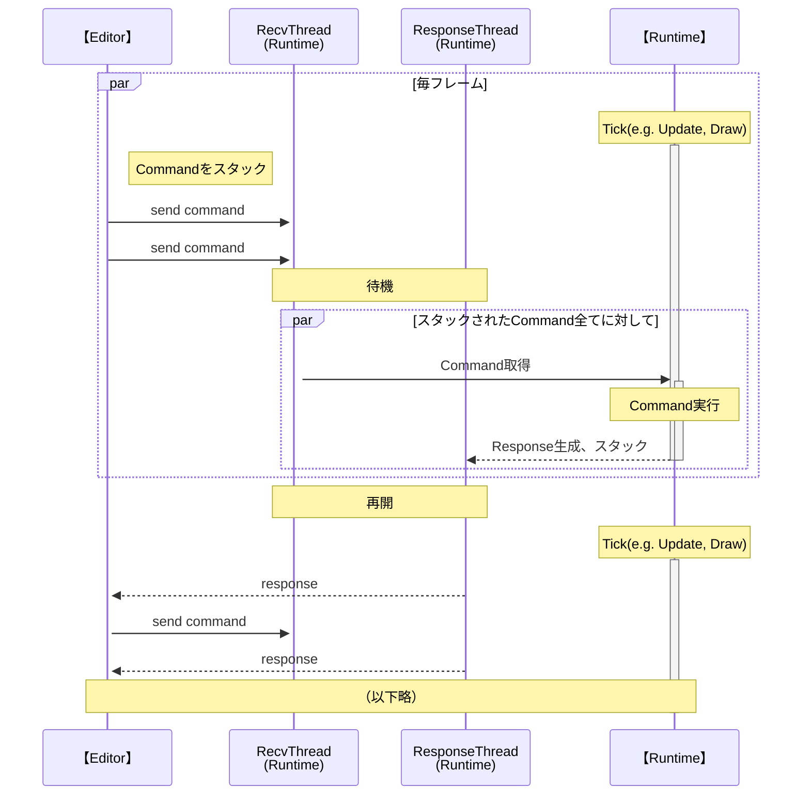
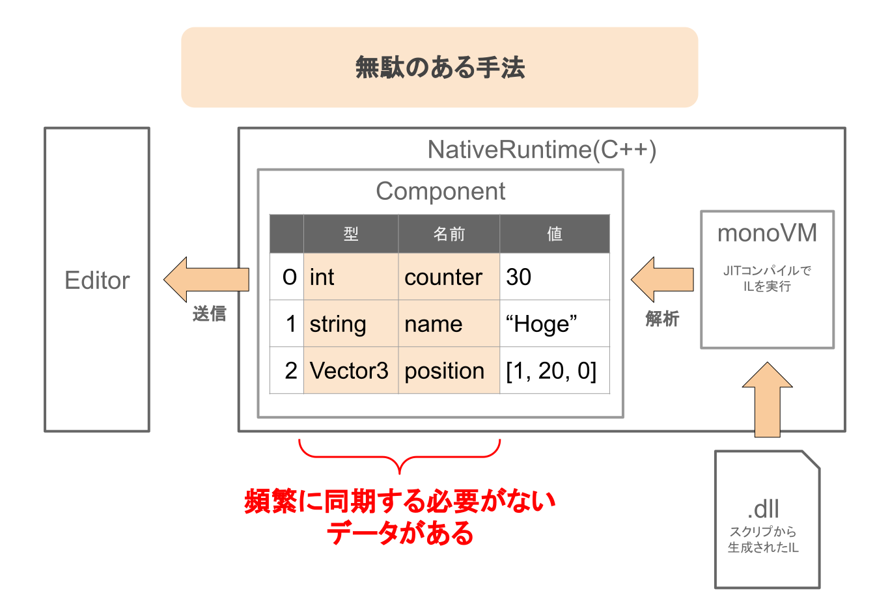
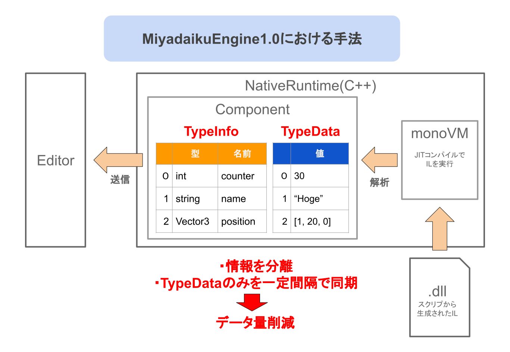

# RuntimeとEditor間のプロセス間通信（IPC）

本エンジンでは、エディタとランタイムのプロセスを分離しています。  
２つのプロセスは、TCP/IPによる通信をすることで連携しています（プロセス間通信、IPC）。

## 導入の経緯

以前、私は[UnityでXbox向けにゲームをチームで開発・リリースしました](../jinrikisha.md)。  
その際、実機での動作確認をしていて、感じていた問題がありました。  
「実装やパラメータを変えたら、そのたびに実機へビルドしなおす必要がある」ということです。  
私はとても無駄であると感じていました。  

自分のエンジンではそれを解決をしたいという思いから、EditorとRuntime間でネットワーク通信によるプロセス間通信を実現しようと考えました。  
**どんなデバイスやプラットフォームで動くRuntimeであっても、PCのエディタからの編集を可能**にしようとしています。  

さらに、編集情報はEditor側でも保持します。  
これにより、仮にRuntimeがクラッシュした場合でも、Editor側から編集情報を復元できるといったメリットもあります。  

このように、UnityやUEでは困難であったことを実現したいと考え、開発中です。  

!!! note
    この手法はネットワーク通信を用いるため、リモートワークなどで開発用の実機が手元に無い場合でも、編集や開発を可能にするといったことも期待できます。  
    リモートデスクトップやVNCとは違って、エディタはローカル上で動作するため、快適に操作ができます。

## TCP/IPを使った理由

通信の安定性を確保するため、UDPではなくTCPで通信をしています。

当初、純粋なTCP/IPでの通信ではなく、gRPCを用いることも検討していました。  
実際に動かして検証しみた結果、自由度の高さなどからTCP/IPで通信プロトコルを構築しました。  

## 通信プロトコルについて

本エンジンに適した、独自の通信プロトコルを構築しました。
頻繁に送受信をするので、通信データ量削減に努めるなどの工夫をしています。  

### 送受信の流れと実装

通信は、Editorを主体とした流れに統一しました。  
Runtimeが「サーバー」、Editorが「クライアント」となるような形式です。

1. Editorは「Command」を作成し、Runtimeへ送信します。  
（例：GetComponents, SetComponent）  
2. Runtimeは受け取ったCommandを実行して、「Response」を生成します。  
3. Responseは、Editorへ送信されます。  
4. Editorは、受け取ったResponseをもとにその後の処理をします。  

### Runtimeでの送受信のマルチスレッド化

Runtimeが受け取ったデータを処理するとき、シングルスレッドでは同期が取りづらく、処理時間も無駄に掛かってしまうという問題がありました。  
そこで、一般的なサーバーの実装と同様に、「受信スレッド」と「送信スレッド」を用意しました。  
これらは常にゲームのTick（更新）処理の裏で動きますが、メインスレッドがCommandを処理する間は一時停止します。  

### コンポーネントのデータの最適化

コンポーネントのデータは、頻繁にやり取りするので通信データ量を削減に努めました。  

やり取りする内容を、「型情報」と「データ」の２つに分けました。
（型情報は一度取得すれば充分だが、データは高い頻度で取得する）

型情報とデータはそれぞれ配列になっていて、Editorはそれぞれを照らし合わせて表示します。  

### 送受信データ形式について

現在は、Json形式のテキストデータを送受信していますが、今後MessagePachやFlatBuffers、そのほかバイナリ形式などの高速な仕組みに移行することも検討中です。  

## Runtimeでの描画結果をEditorに埋め込む仕組み

Editorでのゲームの描画も、Runtimeが行います。  
Runtimeの描画結果をEditorにハメ込むような実装です。  

Runtimeのウィンドウを、Editorの子ウィンドウにすることで実現しました。  
具体的なフローは以下の通りです。  

1. 初期化のタイミングで、Editorの一部領域のWindowハンドルをRuntimeへ渡します。  
2. Runtimeも、別途ウィンドウを作成しておきます。
3. Runtime側のウィンドウを、Editorのウィンドウの子領域に設定します。

今後、他の機器で動作するRuntimeにも対応するために、ストリーミング等による描画への対応も、直近の実装予定としています。  

