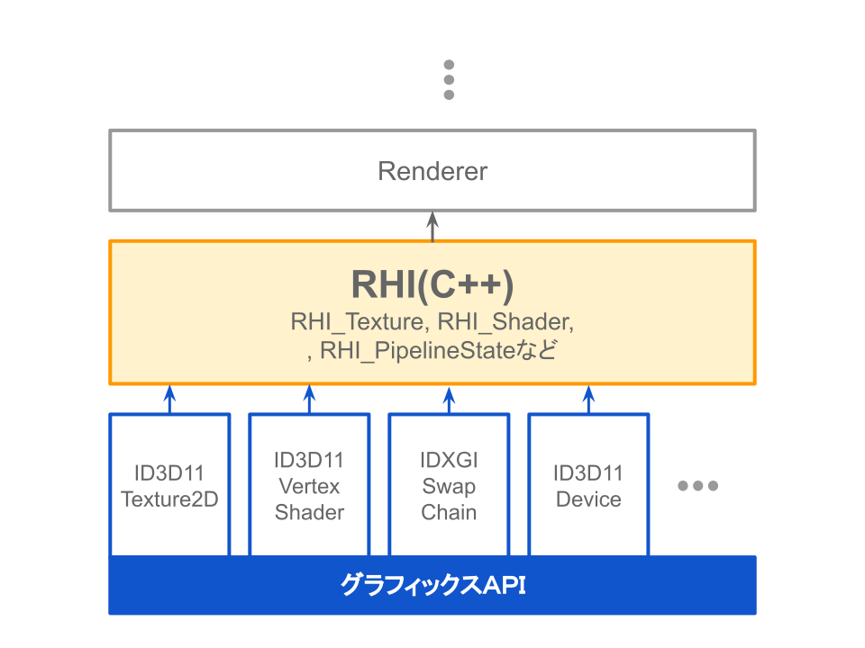

# レンダラ

## RHI（Render Hardware Interface）

**「RHI（Render Hardware Interface）」**は、グラフィックスAPIを薄くラッピングしたインターフェイスです。  
RendererとグラフィックスAPIの中間層です。  
今後のマルチプラットフォーム対応を見据えて、様々なグラフィックスAPIを調査し、最新世代のグラフィックスAPIに合わせる形で設計しました。  

## Draw callとコンポーネント

本エンジンでは、コンポーネント指向を採用しています。  
コンポーネント指向はコンポーネントが機能を持つという概念ですが、Draw callは一切行いません。  
これには２つの理由があります。

- 今後、バッチング処理などでDraw call数を減らす工夫をしやすくするため
- コンポーネントはC#で記述されるので、無駄なメモリ複製や転送が予想される

以上の理由から、Rendererが描画対象のGameObjectを収集し、まとめて描画するような実装にしています。
