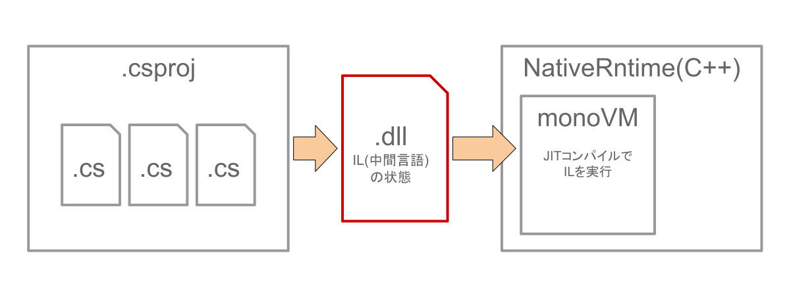
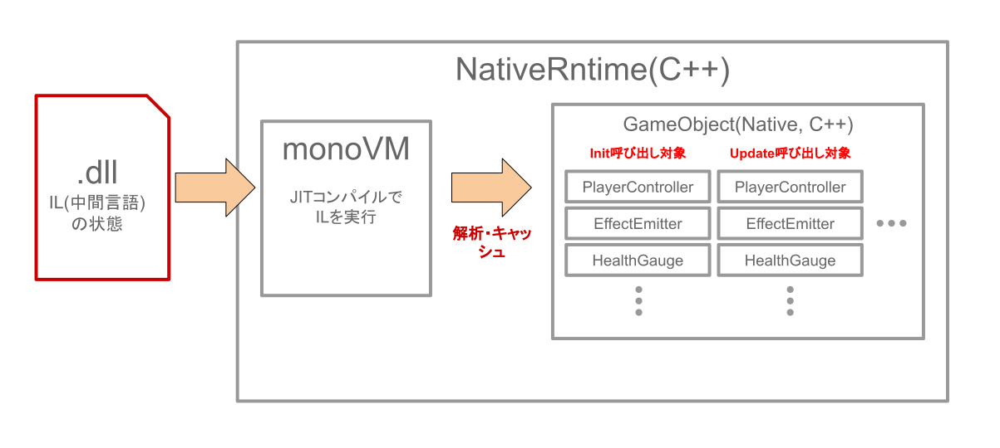
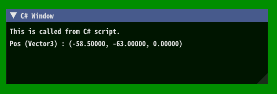

# C#スクリプティングシステム

MiydaikuEngine 1.0は、C#スクリプティングに対応しています。  
これは「Mono ([https://www.mono-project.com/:material-open-in-new:](https://www.mono-project.com/){:target="_blank"}) 」をNativeRuntime（C++）側へ埋め込んで実現しています。  
!!! note
    Monoは、クロスプラットフォームで動作する.NET Framework互換のフレームワークです。


## エンジン標準ライブラリ

算術ライブラリ自作など。  
Vector3などは、IEquatableやIFormattableを実装していて、APIとして運用しやすくした。  

## 型情報とインスタンスの管理

C++側でmonoを使って型情報を解析している。  
`[SerializeField]`属性が付けられたフィールドとプロパティは、シリアライズされ、エディタのInspectorにも表示される。  
オブジェクトはC++側で管理している。  
C++とC#間の相互運用時は、実行時においてユニークな「InstanceID」で管理しています。InstanceIDは、C++では`int32_t`型、C#では`Int`型です。  

## ホットリロード機能

現在準備中です。
参考資料として、過去に実験で実現している私のツイートを添付します。  
（当時は興奮していたため、ツイート文が乱れている点につきましてはご容赦ください）
<blockquote class="twitter-tweet"><p lang="ja" dir="ltr">はい！！！ゲームのスクリプトっぽくして！！！！<br>再コンパイル（ホットリロード）する実験に成功しましたああああああ！！！！！！！<br>ホットリロードめちゃ苦労した…<br><br>（分かりづらいですが、C#スクリプトを変更して、キャラの移動スピード上げてます） <a href="https://t.co/jKKxVFF5i6">https://t.co/jKKxVFF5i6</a> <a href="https://t.co/o6DZWe6WSD">pic.twitter.com/o6DZWe6WSD</a></p>&mdash; 猫茶(実は犬派) (@mewmew_tea) <a href="https://twitter.com/mewmew_tea/status/1536982292413181952?ref_src=twsrc%5Etfw">June 15, 2022</a></blockquote> <script async src="https://platform.twitter.com/widgets.js" charset="utf-8"></script>


## スクリプト（コンポーネント）が呼び出される仕組み

コンポーネントの基底クラスには、UpdateやInitなどの関数は定義していません。  
つまり、関数のオーバーライドや仮想関数は使っていません。  
  
NativeRuntime（C++）側でC#スクリプトを読み込んだ際、monoのAPIを用いてコンポーネントの型情報を取得しています。  
その際に「Updateメソッドが存在するか？」を確認しています。  
存在するときのみ、呼び出し対象のリストに登録して呼び出していますいます。  
なにもしない関数を呼び出すことがないので、無駄なオーバーヘッドを防いでいます。  

!!! note
    C#のSystem.Reflectionも使わないことで、C++側でスクリプト全般を管理することに成功しています。  
    Unityもおそらく同様の仕組みで、そのためにスクリプトの基底クラスは「MonoBehaviour」という名前であると私は推察しています。

## 実行までの流れ




## ImGui（エンジンユーザー用）

本エンジンでは、ユーザーがスムーズにデバッグ等をできるようdear ImGuiを組み込んでいます。  
ユーザーはC#スクリプトで、以下のサンプルソースのようにImGuiを表示することができます。

```C# title="C#スクリプトからImGuiウィンドウを表示"
private Vector3 pos = new Vector3(0,0,0);
private void ImGuiUpdate()
{
    if (ImGui.Begin("C# Window"))
    {
        ImGui.Text("This is called from C# script.");
        ImGui.Text("Pos (Vector3) : " + pos);
    }
    ImGui.End();
}
```


<figure markdown>
<figcaption>実行結果</figcaption>

</figure>
