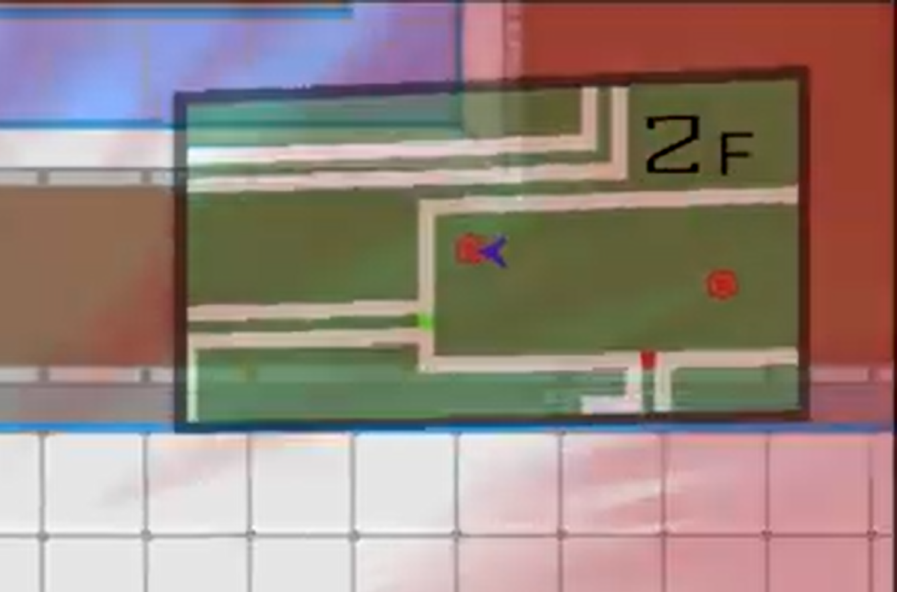

# AUTOMATON MAZE

<iframe width="560" height="315" src="https://www.youtube.com/embed/ZnCv5I311Wc" title="YouTube video player" frameborder="0" allow="accelerometer; autoplay; clipboard-write; encrypted-media; gyroscope; picture-in-picture" allowfullscreen></iframe>

<table border="1">
<tr><td>ジャンル</td><td>2Dローグライクアクション</td></tr>
<tr><td>開発期間</td><td>３か月</td></tr>
<tr><td>開発人数</td><td>４人</td></tr>
<tr><td>開発環境</td><td>C++, DirectX11</td></tr>
<tr><td>プラットフォーム</td><td>WindowsPC( <a href=https://kobedenshigame.itch.io/automatonmaze target="_blank" rel="noopener noreferrer">itch.ioにて配信中</a> )</td></tr>
<tr><td>担当箇所</td><td>企画、メインプログラマ、マップの自動生成、プレイヤーと敵の基礎設計＆実装、バージョン管理</td></tr>
</table>

ローグライク（ローグライト）の2Dアクション。  

## マップ自動生成

マップの自動生成を実装しました。

ゲームバランスが成り立つように、

- 部屋の数
- 部屋の広さ
- 敵の数と種類

を制御できるようにしました。

ゲームの見た目が単調にならないように、数階層ごとに部屋の壁のデザインを変更するといった工夫もしています。

## ミニマップ

自動生成されたマップを、ミニマップとして表示しています。

レンダーターゲットを切り替えてミニマップを描画したあと、  
SF世界観を表現するため、歪ませたような見た目で表示しました。  

