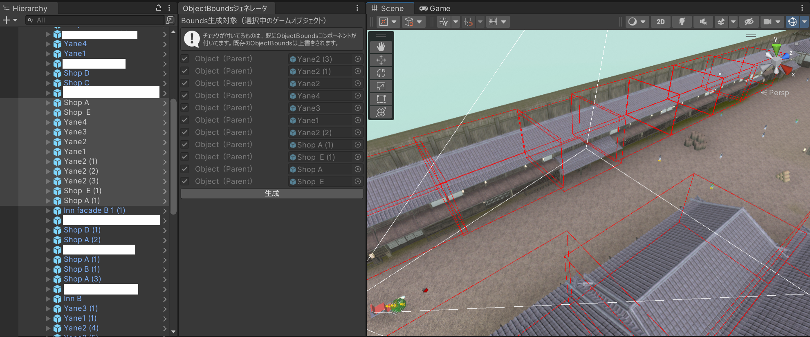

# がっぽり！爆走人力車

<iframe width="560" height="315" src="https://www.youtube.com/embed/9TtBH1gOD1E" title="YouTube video player" frameborder="0" allow="accelerometer; autoplay; clipboard-write; encrypted-media; gyroscope; picture-in-picture" allowfullscreen></iframe>

<table border="1">
<tr><td>ジャンル</td><td>人力車ドライビングアクション</td></tr>
<tr><td>開発期間</td><td>２か月</td></tr>
<tr><td>開発人数</td><td>５人</td></tr>
<tr><td>開発環境</td><td>C#, Unity</td></tr>
<tr><td>プラットフォーム</td><td> Xbox One, Series X|S（<a href=https://www.xbox.com/ja-JP/games/store/44gm44gj44g944kk77yb54ig6lww5lq65yqb6luk/9MXH1BRMFZX0 target="_blank" rel="noopener noreferrer">ストアページ</a>）、WindowsPC（
<a href=https://kobedenshigame.itch.io/jinrikisya target="_blank" rel="noopener noreferrer">itch.ioにて配信中</a>）</td></tr>
<tr><td>担当箇所</td><td>企画、リードプログラマ、人力車（プレイヤー）の挙動基礎設計＆実装、バージョン管理、マルチプラットフォームでの開発管理/パブリッシング</td></tr>
<tr><td>備考</td><td>東京ゲームショウ2022 神戸電子専門学校ブースにて展示</td></tr>
</table>

人力車の車夫として、爆走しながら次々と客をお届けするゲーム。  
企画やリードプログラマなどを担当。  
２か月間という短い期間のなか、５人のプログラマのみで開発。  
Unityで開発し、Xbox Series X|SとWindowsPCでリリース。  

シームレスで広いフィールドを、短期間で作成するために工夫をしました。  

## Unityエディタ拡張でレベルデザインを補助

### 客の配置を行いやすくするエディタ拡張

１５０人を超える客を配置するために、エディタを拡張しました。  
「乗車位置」と「降車位置」を可視化し、  
マニピュレータで直感的にそれぞれを配置できるようにしました。  

また、より良いレベルデザインのために「乗車位置と後者位置を線で結ぶ」という機能も追加しました。   

<table>
<td></td><td></td>
</table>

### 不正な客の配置を検出するツール

床に埋まっている、空中に浮いている、ステージ外にあるなど、  
不正な配置をしてしまうという辞退が発生しました。  

そこで、それらを自動で検出できるツールも、Unityエディタ拡張で作成しました。  

## 最適化とエディタ拡張

規模が大きくてシームレスなマップなので、フレームレートの低下が大きな問題となりました。    

プロファイリングの結果、マップ上の建物が特に重いことが分かりました。  
マップの負荷の軽減が急務となりました。  

### 遠景の建物を簡易な共通3Dモデルとして描画

まず、ゲーム性の都合から遠景を描画する必要があったため、LoDによる解決をしようとしました。  
**しかし、開発メンバーは５人のプログラマのみ、開発期間も２か月という短期間であったので、LoDモデルを作成することは現実的ではありません。**  

そこで、一定以上離れた距離にある家は、共通の簡易な3Dモデルとして描画しています。  

（左：通常時、右：遠いとき、共通の簡易3Dモデルとして描画されている様子）
<table>
<td></td><td></td>
</table>

### 共通簡易3Dモデルのスケール情報をエディタ拡張で事前計算
 
建物を共通の簡易3Dモデルとして描画する際、  
拡大縮小を決めるためにバウンディングボックスの情報を取得する負荷が高く、処理落ちしていました。  

これは、バウンディング情報を事前計算しておくことで対策しました。  

バウンディング情報を一括で計算、出力するツールを、Unityのエディタ拡張で作成しました。  
実行時は、事前計算情報を参照するだけなので、処理負荷を大きく削減できます。

## Xbox版とPC版の同時開発

本作は、PCに加えてXboxコンソールでもリリースしました。  
開発当初から、このことを留意して開発しました。  

### こまめなXbox実機上での動作確認
  
こまめにXbox実機上でテストプレイをしました。  

正しくビルドができるか等に加えて、  
実機の性能は開発PCの性能に比べて低いため、処理落ちしていないか等も確認しました。  

### Xboxの種類ごとのスペック差への対応

Xboxの対応機種は、４つあります。

- Xbox One
- Xbox One X
- Xbox Series S
- Xbox Series X

それぞれのスペック差が大きいため、  
機種名を取得して機種を判別し、  
自動でグラフィックス設定を変更するようにしています。  

### XboxとPCでの仕様の違い

機種ごとに機能や仕様を変更した部分もあります。  

C#のプリプロセッサなどを活用して、ビルド先によって実装を変更しています。  

仕様が異なる箇所の例

| 概要 | PC版 | Xbox版 |
|--|--|--|
| メニュー画面の「ゲームを終了」ボタン | 〇 | ー |
| DualShockとキーボードマウスへの対応 | 〇 | ー |
| 機種の判別とグラフィック設定の自動変更 | ー | 〇 |

## 複数のコントローラ種に対応したキーガイドGUI

PC版では、直近に操作したコントローラの種類を識別して、  
キーガイドの表示を自動で切り替えるようにしています。  

例えば、  

- キーボード＆マウスを使っている間：「Esc：戻る」  
- Xboxコントローラを使っている間：「B：戻る」
- DalShock（PS4）コントローラを使っている間：「×：戻る」

のように、いつでも自動で切り替わります。  

また、私が開発に関わったゲームパッド対応のPCゲームには、すべてこの仕組みを実装しています。  

コントローラ種別の識別方法については、Qiita記事にまとめています。  
[Unityでコントローラーの種別を識別する(InputSystem) - Qiita](https://qiita.com/mewmew_tea/items/7d4df683df490b03d9a4)

